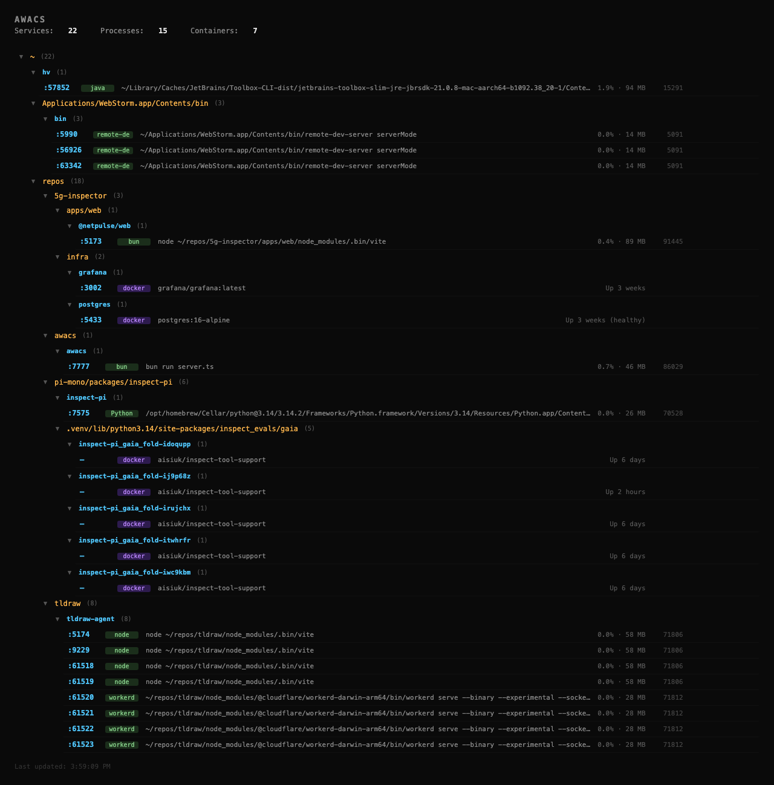

# AWACS

A local dashboard that discovers and displays every server running on your machine.



---

## Looking for compute sponsors

I'm looking for ~500M tokens from an open source model provider to eval an agent harness that allows an AI agent to backtrack in its own context window. If you can help or know someone who can, please reach out.

- [GitHub: hvent90/llm-gateway](https://github.com/hvent90/llm-gateway)
- [Twitter thread with more context](https://x.com/hvent90/status/2035838877710401784)

---

## What it does

AWACS scans your system for listening TCP ports and maps each one to its process, working directory, and project name. It presents everything in a collapsible folder tree via a web UI.

- Discovers native processes via `lsof` + `ps`
- Discovers Docker containers via `docker inspect` (including compose project paths)
- Resolves project names from `package.json`, `mix.exs`, `Cargo.toml`
- Groups services by filesystem path in a collapsible tree
- Clickable port links to open services in browser
- Kill / restart individual processes or entire projects
- Live updates via SSE — detects process death within 1s, new processes within 10s
- Accessible from other machines on your LAN

## Requirements

- macOS (uses `lsof` output format specific to macOS)
- [Bun](https://bun.sh)
- Docker (optional, for container discovery)

## Usage

```
bun run start
```

Open `http://localhost:7777`. From other machines: `http://<your-ip>:7777`.

## How it works

```
lsof -iTCP -sTCP:LISTEN    →  port:pid mapping
ps -p <pid> -o args,pcpu…  →  command line, cpu, memory
lsof -p <pid> -d cwd       →  working directory
package.json / mix.exs      →  project name
docker inspect              →  compose working dir + service name
```

These are combined into a tree: **folder path → project name → services**. A background PID watcher checks liveness every second and triggers an immediate rescan + SSE push when anything dies. A full rescan runs every 10s to pick up new processes.
